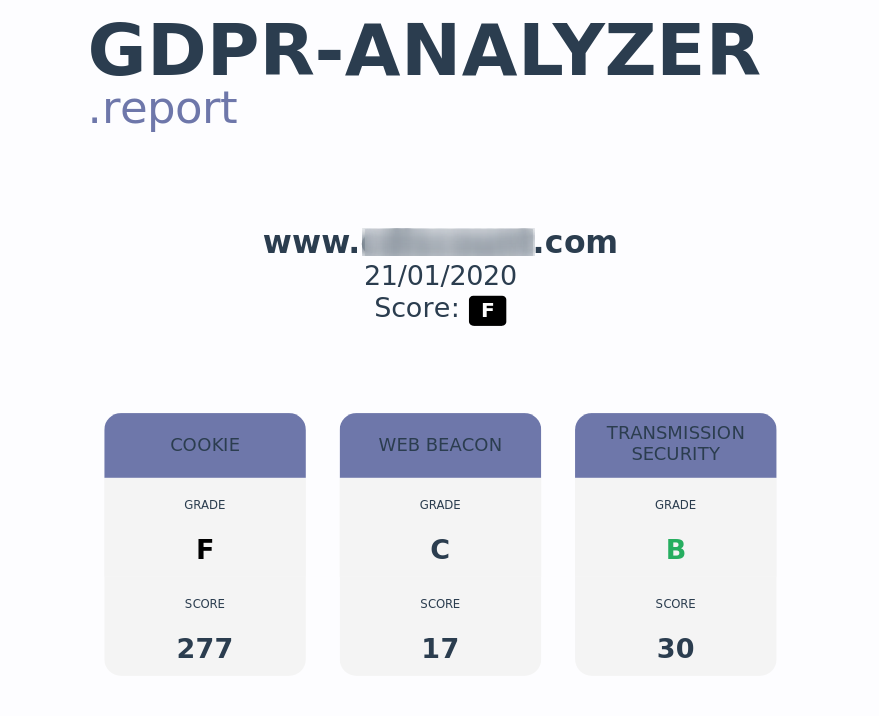

# GDPR Analyzer

## About
This tool allows the analysis of a website to check its compliance with the GDPR.
The purpose of the project is to use publicly available website data (source code), its interactions with the web browser and the security of the transmission between the client and the server that hosts it in order to write a nominal report and assign a compliance score. A scoring grid can be generated to understand the score obtained.

The tool is not intended to cover the entire GDPR. As stated above, only publicly available information will be analyzed. As a result, not all information can be studied and the report can only rarely be exhaustive as to the use of data and the storage and protection methods put in place by the website owner.

## Screenshot
### Help


### Report


## Installation
```bash
git clone https://github.com/dev4privacy/gdpr-analyzer.git
```

## Recommended Python version
GDPR Analyzer currently supports *Python 3.7+*

## Dependencies

GDPR Analyzer requires the following tools:
* OpenSSL ≥ 1.1.1 (https://www.openssl.org)
* Firefox ≥ 60 (https://www.mozilla.org/en/firefox/new/)
* geckodriver ≥ v0.26.0 (https://github.com/mozilla/geckodriver)

Also depends on the following python modules: `splinter`, `requests`, `mozprofile`, `pyopenssl`, `jinja2`, `weasyprint`, `bs4`, `tinycss`

These dependencies can be installed using the requirements file:
* Installation on Linux:
```bash
sudo pip install -r requirements.txt
```

Alternatively, each module can be installed independently.

## Usage

Short Form    | Long Form     | Description
------------- | ------------- |-------------
-f            | --full        | Get Full Analysis
-c            | --cookie      | Analyze the cookies and generate the score
-w            | --webbeacon   | Search the presence of web beacon and generate the score
-t            | --crypto      | Analyze the security of the connection with the website and generate the score
-r            | --report      | Generate a pdf report
-j            | --json        | Export the result in json

## Examples
To use all analysis options:

`python gdpr_analyzer.py -f example.com yourname`

To search the presence of web beacons and generate a pdf report:

`python gdpr_analyzer.py -w -r example.com yourname`

To analyze the security of the connection with the website and export the result in a json file:

`python gdpr_analyzer.py -t -j example.com yourname`

## Disclaimer
You accept all responsibility for the use of this anlysis tool. Its use does not imply the responsibility of the project developers.

The purpose of this tool is to provide an evaluation grid (defined with our own criteria). However, if errors are brought to our attention it will be our care to correct them. Anyhow, the developers of the GDPR Analyzer project does not engage any responsibility for the usage of the generated report.

It is not necessarily complete.

## Version
**Curent version is 0.1**

## License
GDPR Analyzer is licensed under the [GNU GPL v3.0](LICENSE.md).
